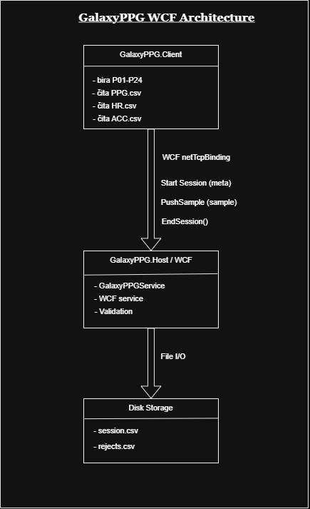

# VP Projekat

## Opis projekta

Projekat implementira WCF sistem za razmenu i obradu PPG/HRV podataka sa nosivih uređaja.

Klijent učitava PPG.csv, HR.csv i ACC.csv podatke iz GalaxyPPG dataset-a i šalje ih WCF servisu korišćenjem netTcpBinding komunikacije.

Servis validira podatke, čuva ih na disku i vrši obradu i analizu podataka.

---

## Arhitektura sistema

